# 快速入门

## 在线体验

http://jqp.hyz792901324.com/

账号 admin

密码 1

登录后选择企业2,企业2目前配置了全量的权限

## 增删改查

### 流程

1. 左侧菜单,系统管理->数据库表,新建,**注意,建表会自动增加id列,自增主键,如果再增加id主键会报错**
2. 建完表后点击**一键生成**,会自动生成列表页面和表单页面,带有增删改查功能,并且会自动新建一个顶级菜单
3. 左侧菜单,系统管理->页面管理,这是列表页面,根据表 test,找到刚才生成的页面,增加查询条件,调整显示字段,默认没有配置查询条件
4. 左侧菜单,系统管理->表单管理,这是表单页面,根据表test找到刚才生成的表单,调整字段
5. 左侧菜单,系统管理->菜单管理,调整菜单所属目录位置
6. 左侧菜单,人员组织->企业管理,找到企业02,配置企业菜单,勾选刚才创建的菜单
7. 右上角用户名下拉,退出登录,重新登录,就能看到功能了

### 截图

#### 建表

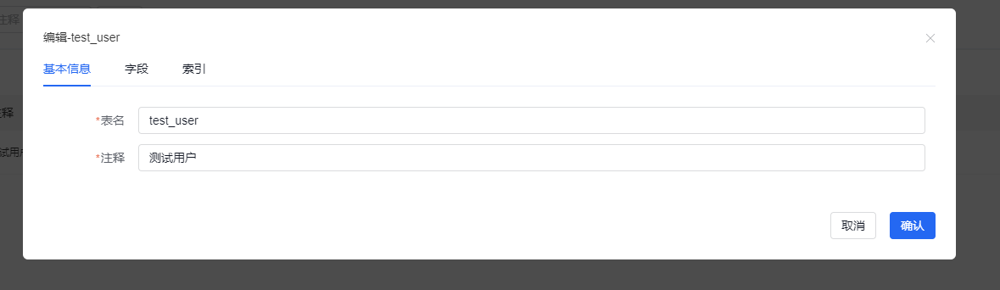

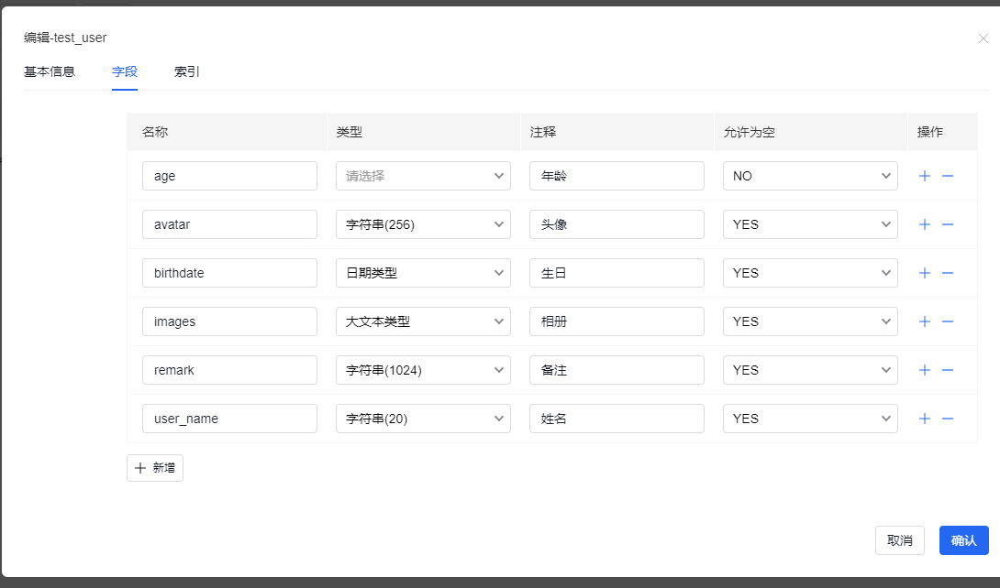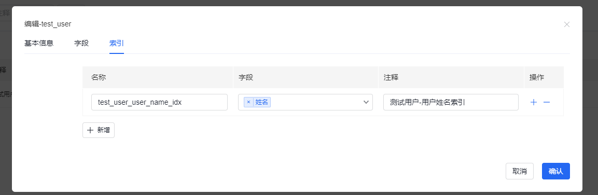

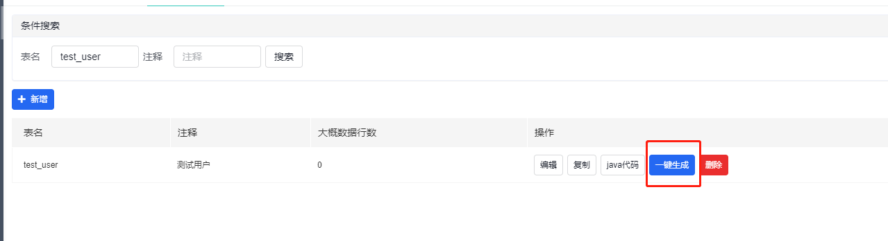

#### 列表页面配置

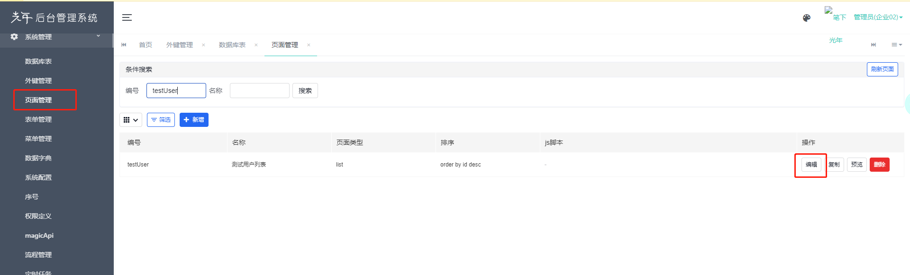

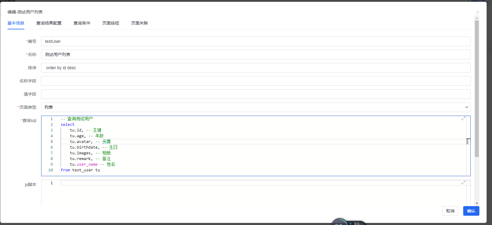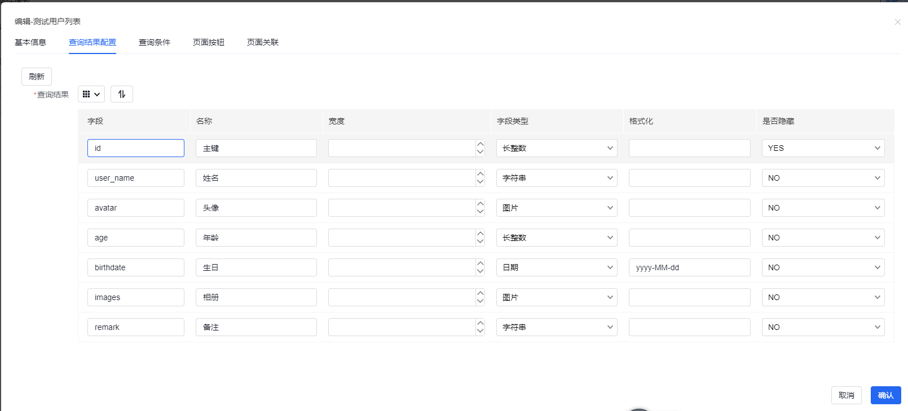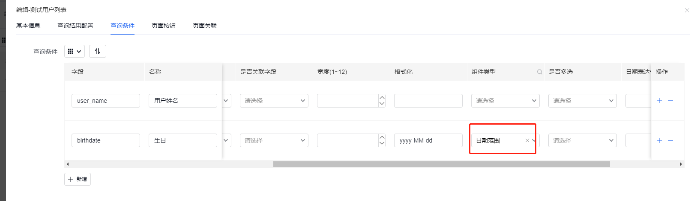

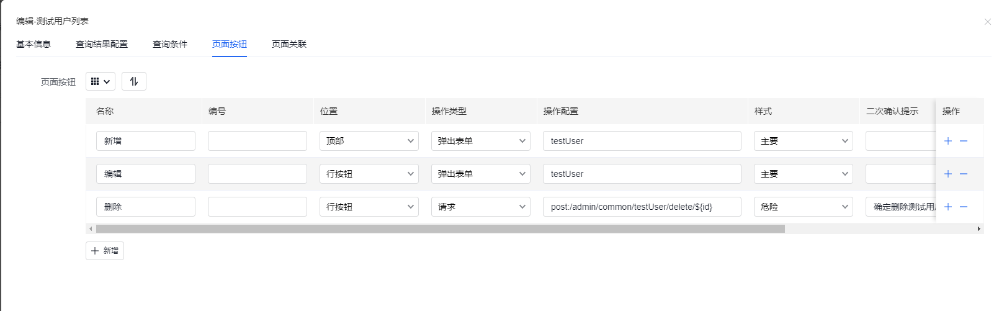

表单页面配置

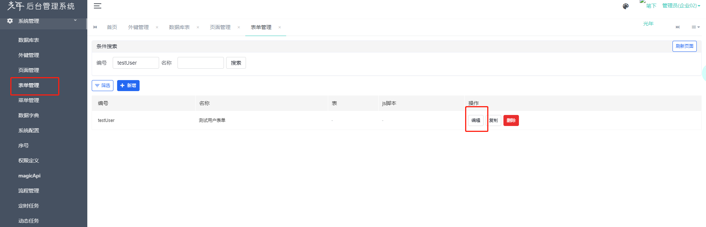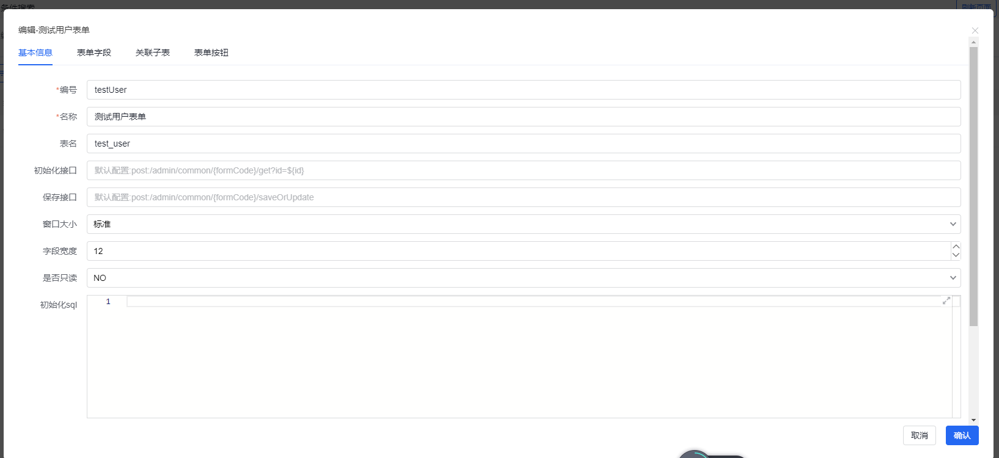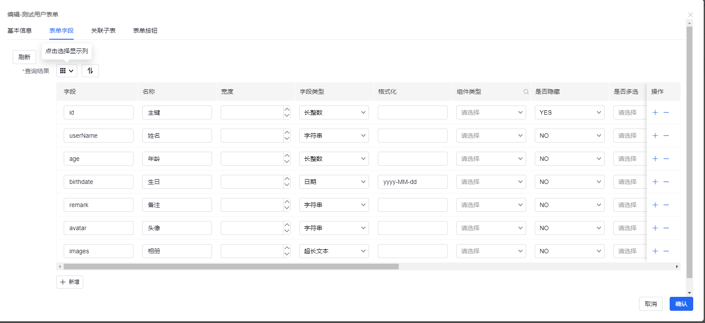

#### 菜单配置

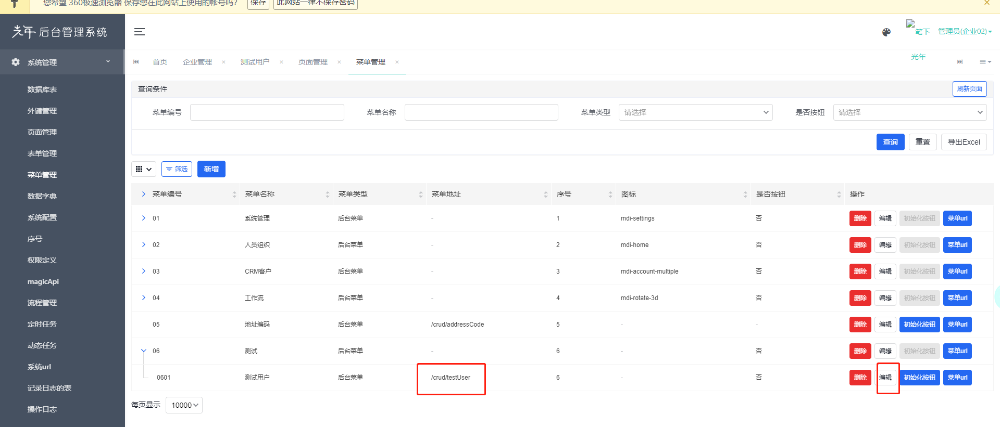

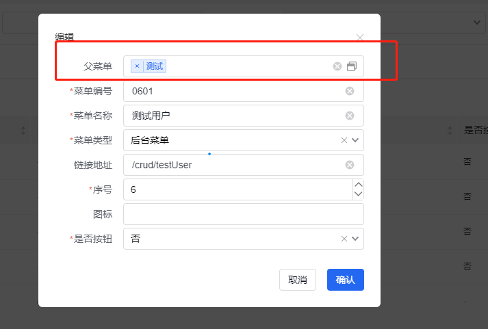

#### 配置企业菜单

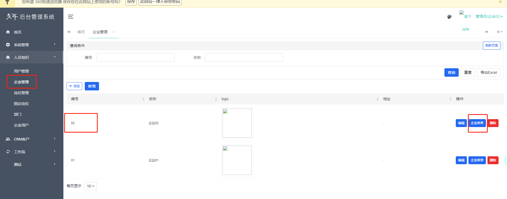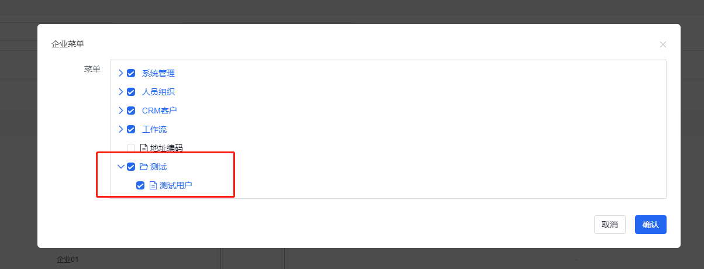

#### 退出重进

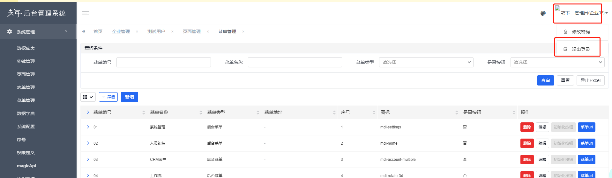

#### 最终效果

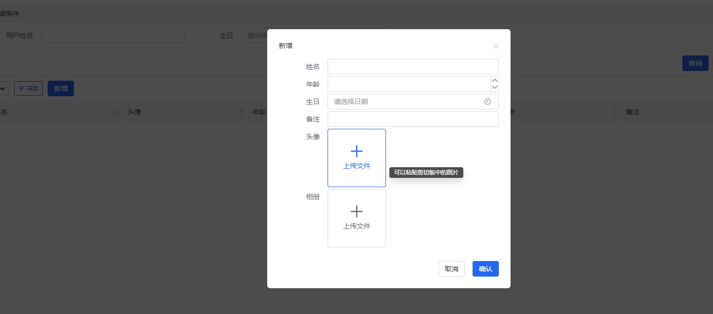

# 安装

## 环境

1. jdk8
2. mysql8
3. maven
4. idea

## 克隆代码

git clone https://gitee.com/hyz79/jqp-admin.git

## 初始化数据库

项目 /db/  目录下面有两个文件,任选其中一个恢复即可

1. 数据库名jqp,编码utf8
2. nb3文件,Navicat备份文件,复制到备份目录,右键还原,可以直接用Navicat还原
3. -sql.zip文件,解压后导入到jqp
4. 截图

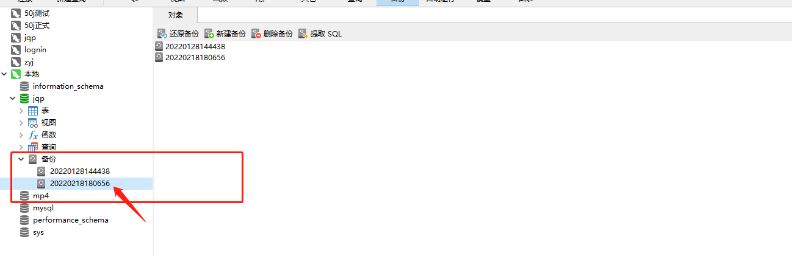

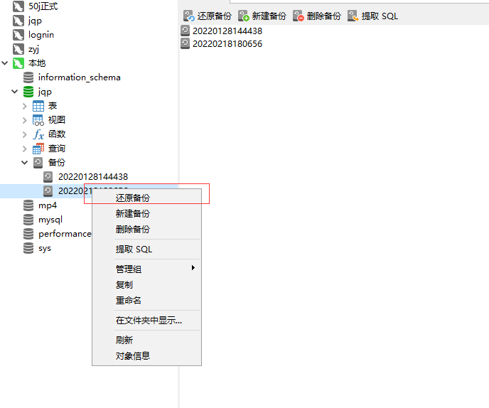

# 详细讲解

## rbac组织机构

1. 总体来说就是    **企业->人员-岗位-菜单按钮**
2. 菜单 sys_menu
3. 用户 user 用户,用户分为普通用户和管理员,管理员可以拥有全部企业,全部企业菜单功能
4. 企业 enterprise
5. 企业管理员 enterprise_manager 企业管理员拥有此企业下全部菜单功能
6. 企业菜单 enterprise_menu
7. 岗位 position,岗位分固定岗位和自定义岗位,岗位编码全局唯一,岗位配置菜单是配置当前所在企业的菜单
8. 企业岗位菜单 position_menu
9. 企业人员 ,enterprise_user,创建企业用户会自动创建user表和enterprise_user关联,也可以关联其他企业用户
10. 企业人员岗位 enterprise_user_position
11. 权限定义 permission,字典为selfOrAll 的是自己/全部,字典为dept为部门级别数据权限
12. position_permission 岗位数据权限
13. dept_permission 部门数据权限
14. 用户菜单逻辑,管理员取企业全部菜单,包含系统管理员和企业管理员
15. 关联关系,用户->用户岗位->用户岗位菜单
16. 数据权限,用户所在部门的数据权限和用户拥有全部岗位的数据权限和用户数据权限进行合并,取并集,最大范围
17. 数据权限使用,在页面配置的查询sql里面 增加$service.permission('{code}','{field}') code为权限编码,field为当前查询对应的权限字段
18. magicApi是表单前后置逻辑,返回字符串表示失败,返回null表示成功,最主要的写业务逻辑的地方,注意不要使用数据库增删改不要用magicApi内置的db接口,这样会导致无法记录字段日志

## 外键管理

主要用于做级联删除,删除主表后会自动删除关联的字表

## 菜单按钮配置

### 权限控制

在菜单管理里面有初始化按钮,点击后会自动的找到对应的列表页面,表单页面,下面的按钮,生成菜单按钮,并且吧按钮编号反写到对应的列表/表单按钮里面,如果按钮编号不配置,也就是不做按钮控制,任何人都能使用

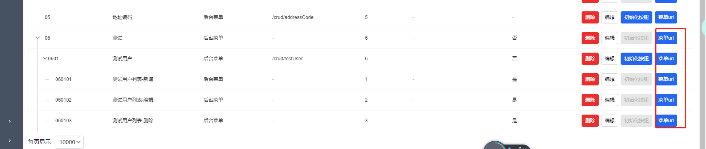

### 公共url

没有关联菜单按钮的就是公共url,不用登录就能访问

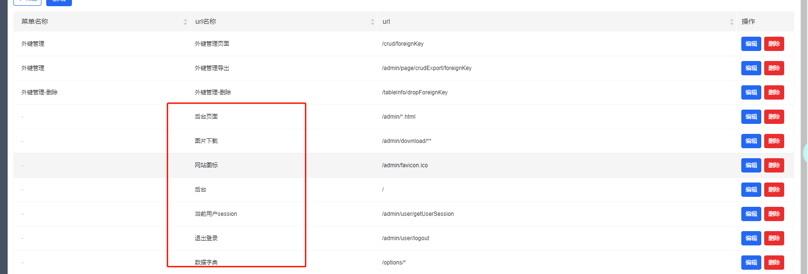

### 按钮操作类型

#### 例子

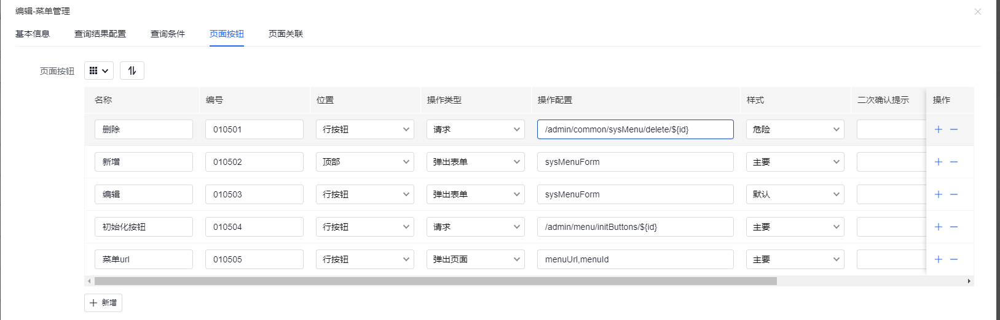

### 按钮配置的规则

这是**禁用规则,就是什么条件下,这按钮不能用**,能得到的参数是当前行的数据字段,也可以是隐藏的字段,注意**不需要携带$符号**

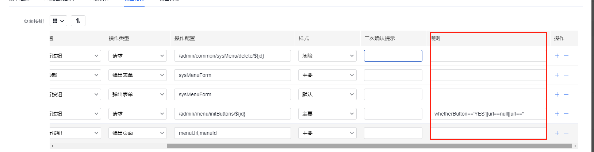

#### 弹出表单

操作配置填写**表单编号**,会自动携带id字段到表单里面

#### 弹出iframe

自定义的页面,无法通过配置出来的,可以用这种方式,参数携带可以有多个

#### 弹出页面

操作配置用逗号隔开的字符串,第一个是列表**页面编号**,第二个是关联的字段,主表的id,关联字表对应的字段

#### 请求

ajax请求,可以有get/post请求,点击会自动有二次确认的弹出提示,可以在按钮配置提示的内容,默认是 格式  确认{按钮名称}操作吗?

1. get请求:   get:/xxx    可以携带参数 ${字段名}
2. post请求: post:/xxx  携带json格式的requestBody

#### 打开新窗口

浏览器打开新的窗口页面,可以配置多个参数例如:

http://www.baidu.com?id=${id}&name=${abcName}

#### 批量操作

配置值有所不同,然后,位置选择批量操作即可

get:/amis/api/mock2/sample/${ids|raw}

示例

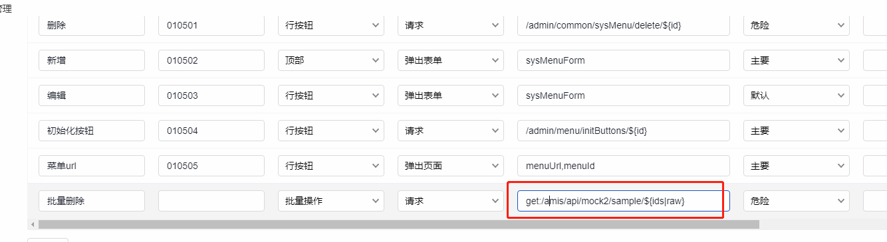

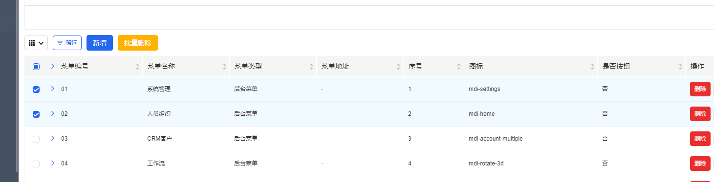

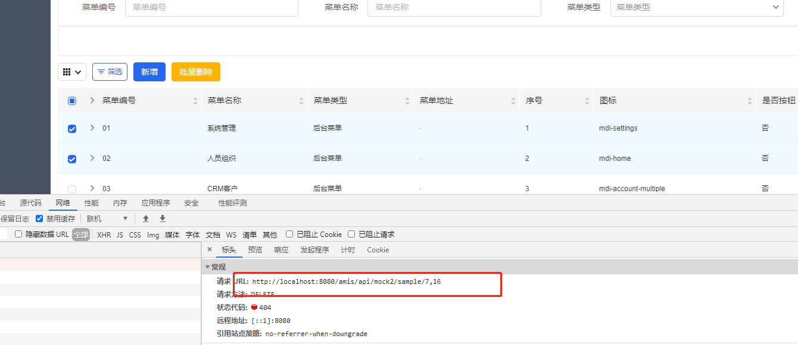

## 数据权限配置

### 整体思路

权限定义

1. 看自己/全部的数据权限
2. 看本部门/本部门及子部门/负责部门/负责部门及子部门/全部部门
3. 其他权限,可以选择一个页面/字典/sql语句查询出一个列表,在这个列表里面做多选/单选/树结构选择

权限配置,可以在岗位,部门,人员上面配置数据权限,使用的时候会取当前登录人所能关联到的对应配置权限的最大集合

权限使用,在列表页面里面的sql拼接权限,

使用 $service.permission('dept','c.dept_id')   ,其中,dept是权限编码,c.dept_id是在本列表页面中的部门字段

java代码在 TemplateService 里面,这个是在TemplateUtil.getValue里面注入进去的

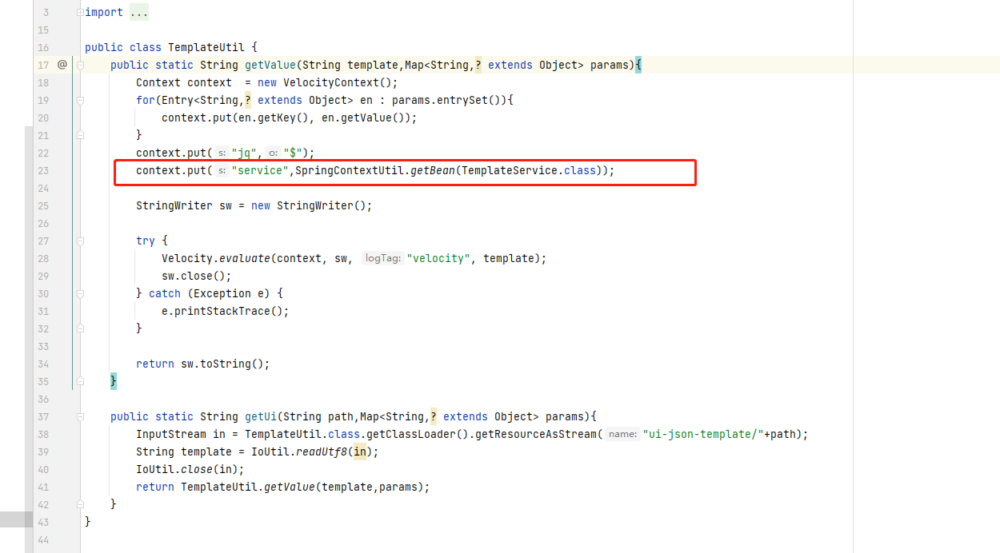

#### 例子,截图

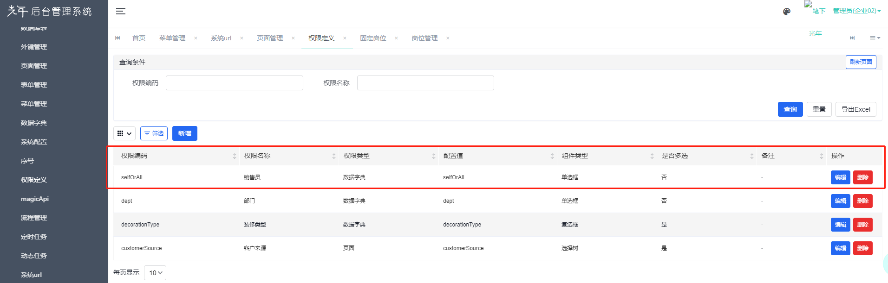

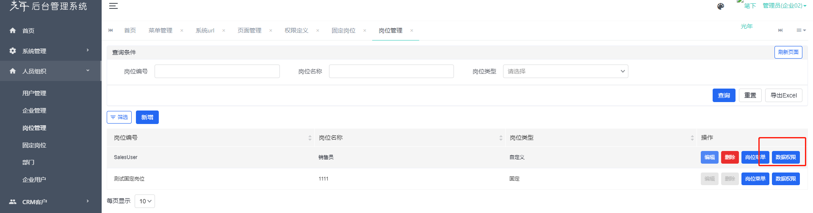

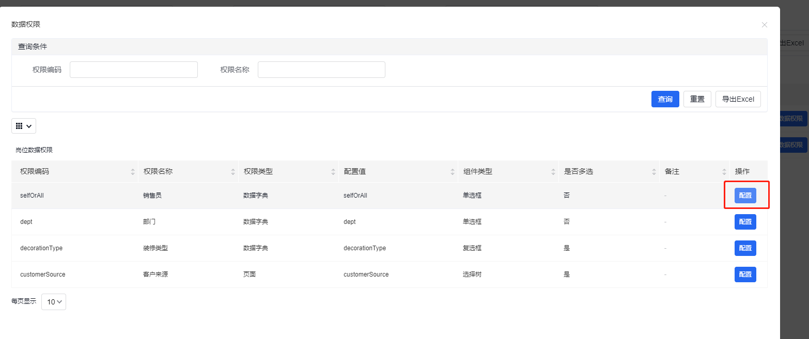

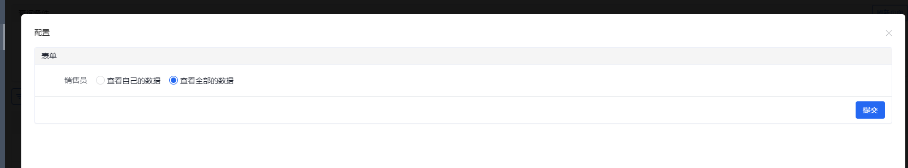

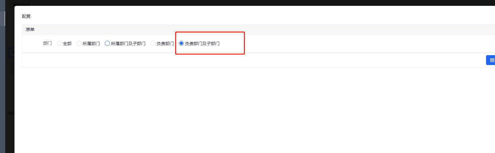

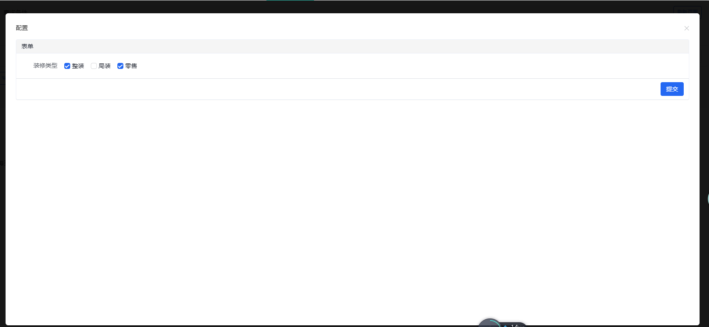

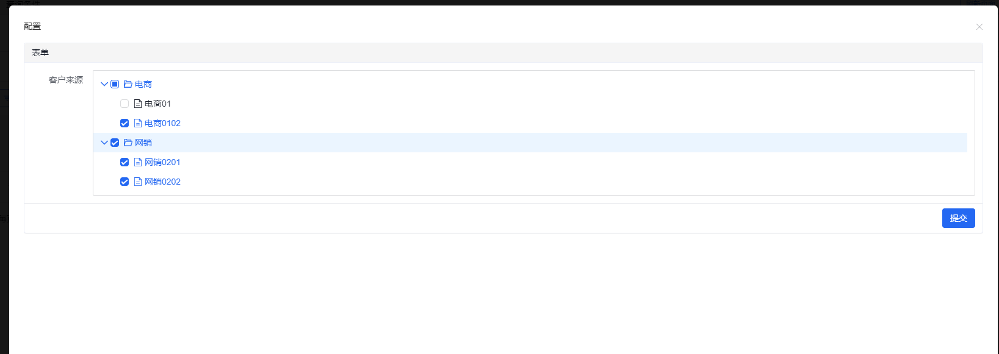

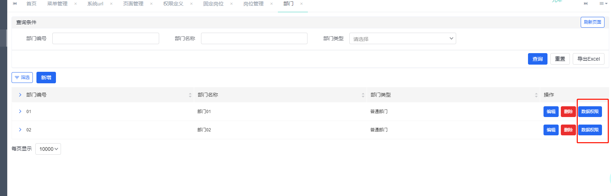

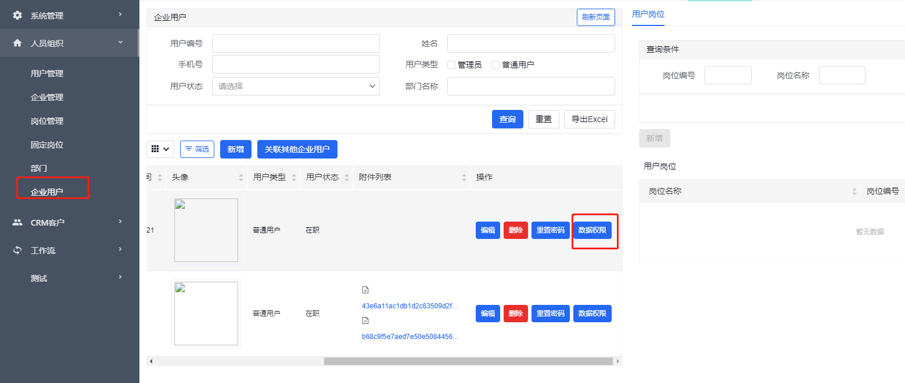

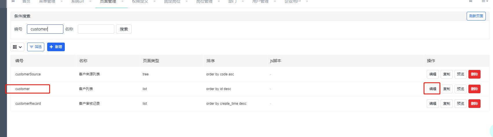

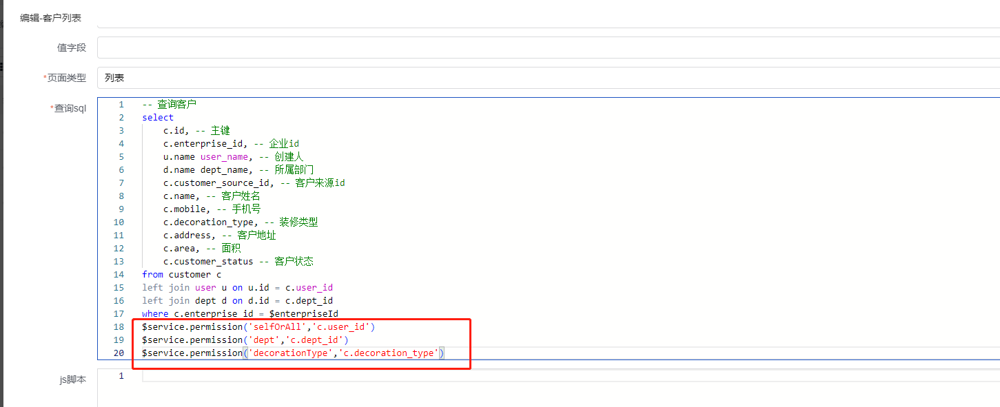

## 列表配置

### 查询sql

注意,这里面用了TemplateUtil.getValue方法,会自动的注入TemplateService这个,提供数据权限配置,可以做额外扩展

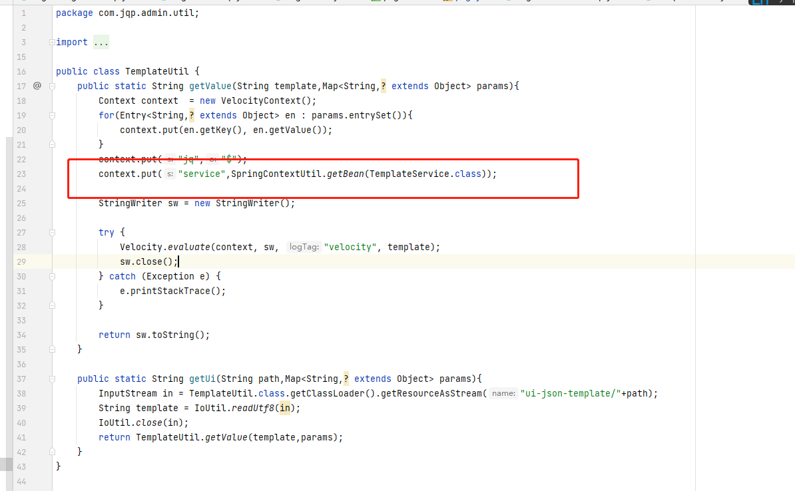

js配置暂时没有用上

页面宽度在页面关联里面会讲到

名称字段,值字段,用于提供给下拉框组件,选择器组件,或者是数据权限等里面使用到的

### 查询结果配置

配置完sql后,在查询结果配置点击刷新,会自动根据查询结果的字段,匹配对应的类型,中文

宽度,可以调整这个列的宽度

特殊字段类型

#### 日期类型

日期类型必须要配置格式

#### 字典类型

字典类型格式化,配置为字典编号

#### 其他类型

会自动展示

### 查询条件配置

#### 字段

名称和结果里面的字段一致,比如user_code,不能写成userCode,

#### 操作类型

多值的话,后台是逗号隔开的字符串,

包含是模糊匹配

#### 数据类型

##### 数据字典

需要在格式化里面配置字典编号

##### 选择器

需要在格式化里面配置列表页面的编号

##### 日期类型

需要配置日期格式化

##### 图片/文件类型

可以配置为字符串,然后在组件里面选择图片,文件,可以配置单选多选

##### 其他类型

配置单选/多选,配置组件类似

### 配置按钮

参考详细讲解->按钮配置规则

### 页面关联

对于列表页左右布局,可以在基本信息,配置页面宽度,12是100%,6是50%,关联页面是12-主页面宽度

多个子页面用tab分开

**注意注意:查询条件里面有一个是否关联字段,如果为是的情况下,在没有选择主表的时候默认值是-1,也就是必须要有主表才能查询/新增,新增的时候也要注意配置按钮禁用**

例如,字典和字典明细

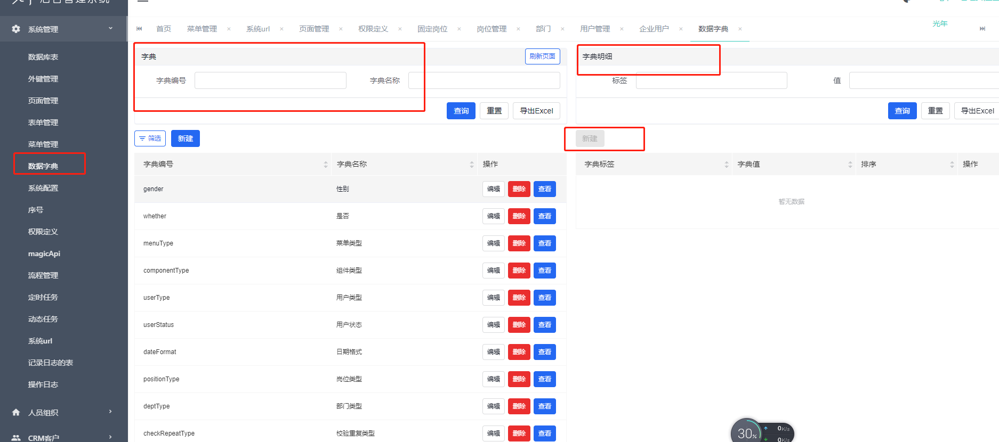

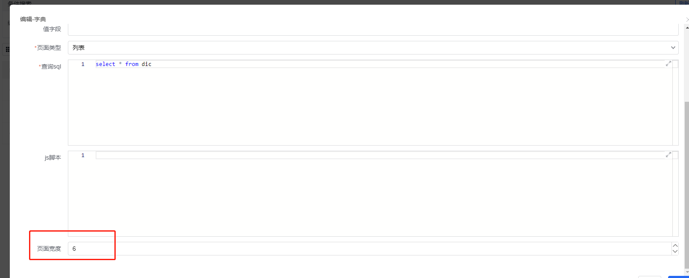

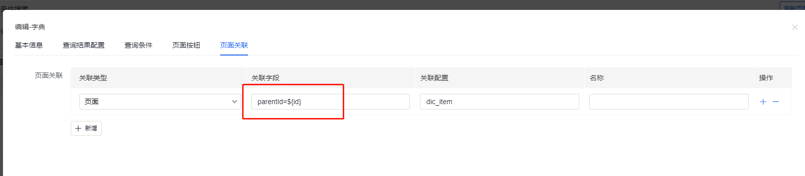

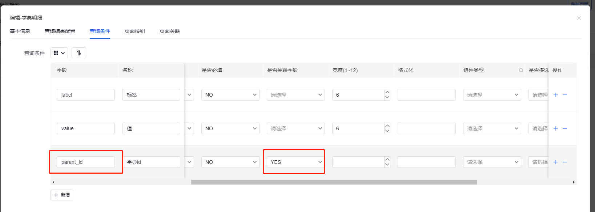

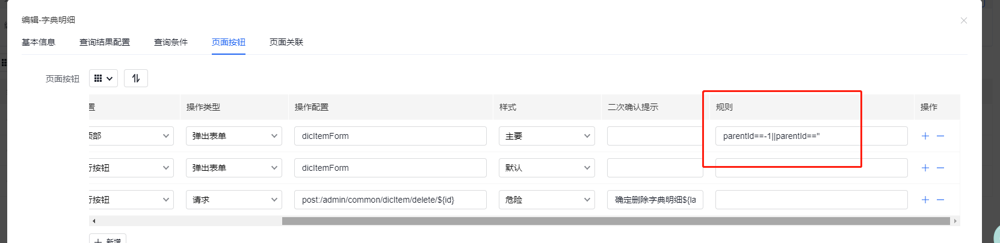

## 表单配置

### 基本信息

1. 初始化接口,新建/编辑会根据id查询数据,带到表单里面,如果默认的不满足条件,可以增加初始化sql,会自动的把查询的sql里面字段,按照字段名赋值给表单,可以有多个sql,用分号   ; 隔开,也可以自定义
2. 保存接口,有默认的,通用保存接口,不满足可以自定义,公共的保存在CommonController里面
3. 字段宽度,栅格布局,12为100%一行,6为50%,这是默认的每个字段宽度,每个字段上也可以单独配置
4. 前置接口,保存前的校验,这是和magic-api链接的地方,返回值不是空的情况下就表示校验失败,不会保存,且提示失败原因,是magic-api返回的字符串
5. 后置接口,在默认保存后调用的,也在CommonController里面,会将默认保存和后置接口,封装到同一个事物里面,保证事务一致性
6. 前置接口和后置接口都可以有多个,用换行符隔开,参数可以查看CommonController里面源码
7. 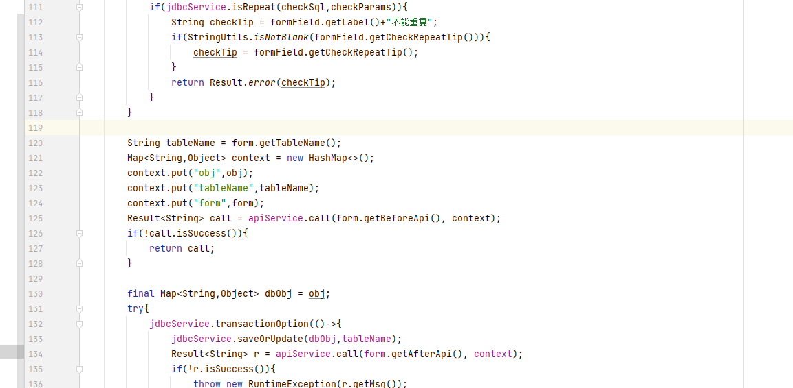

### 组件

有一种特殊的场景,只有一个关联字段,比如用户关联岗位,去选择多个岗位,

可以参考

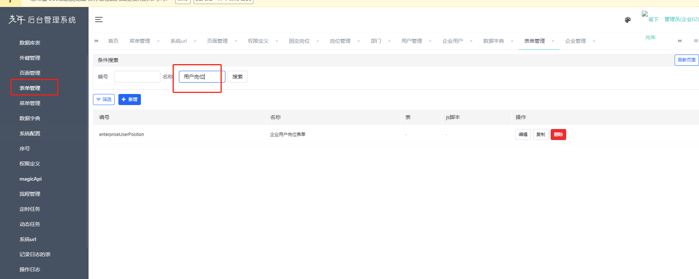

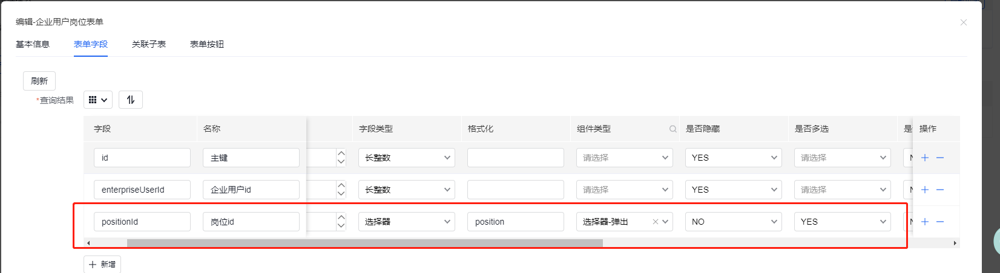

### 字段配置

实际上和列表的字段配置很类似,增加重复校验

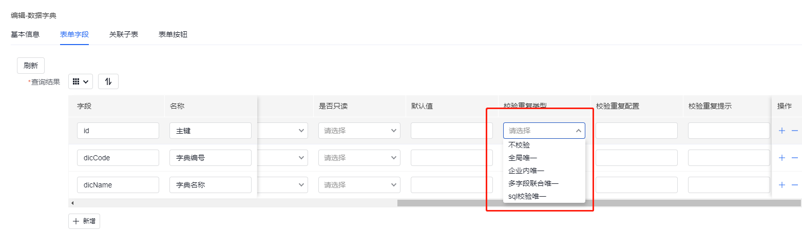

其中多字段联合唯一,将多个字段用逗号隔开,配置到校验重复配置里面

sql校验唯一,写一段sql,放到校验重复配置里面,具体的代码也是参考CommonController的保存方法

#### 字段默认值

除了配置固定值之外,还能配置其他信息,比如当前用户,当前时间,自动生成订单号等等,参考TemplateService,配置实例,$service.serial(序号编码),

默认数据表更新和插入时间，只需要定义相应的名字即可，不需要额外操作：field名称设置为updatedAt 为数据库更新时间；名称为createdAt为数据表插入时间

#### 子表配置,InputTable

字段类型,随便选,不起作用,组件类型选择表格InputTable,格式化字段填写为 表单编号,关联字段id,例如 字典明细表  dicItemForm,parentId

注意,这里配置的子表必须要加字段名称为seq,类型为number(11),的排序字段,可以通过拖拽排序,后台保存自动填入,参考

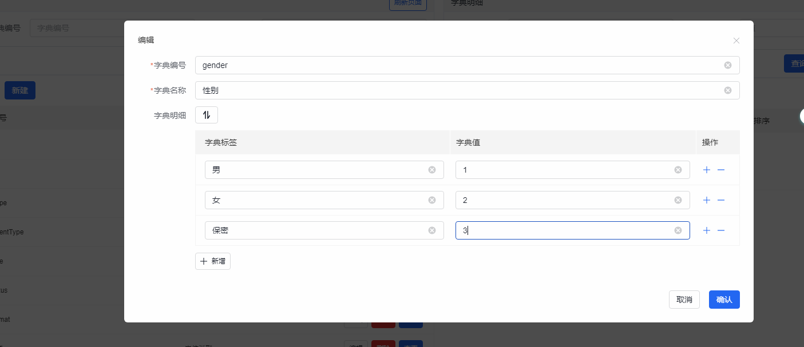


#### 字段校验

参考百度amis官方文档,以下是复制的

配置值为  `isNumeric,minimum:10`,多个校验用逗号隔开

支持的格式如下

* `isEmail` 必须是 Email。
* `isUrl` 必须是 Url。
* `isNumeric` 必须是 数值。
* `isAlpha` 必须是 字母。
* `isAlphanumeric` 必须是 字母或者数字。
* `isInt` 必须是 整形。
* `isFloat` 必须是 浮点形。
* `isLength:length` 是否长度正好等于设定值。
* `minLength:length` 最小长度。
* `maxLength:length` 最大长度。
* `maximum:number` 最大值。
* `minimum:number` 最小值。
* `equals:xxx` 当前值必须完全等于 xxx。
* `equalsField:xxx` 当前值必须与 xxx 变量值一致。
* `isJson` 是否是合法的 Json 字符串。
* `isUrlPath` 是 url 路径。
* `isPhoneNumber` 是否为合法的手机号码
* `isTelNumber` 是否为合法的电话号码
* `isZipcode` 是否为邮编号码
* `isId` 是否为身份证号码，没做校验
* `matchRegexp:/foo/` 必须命中某个正则。
* `matchRegexp1:/foo/` 必须命中某个正则。
* `matchRegexp2:/foo/` 必须命中某个正则。
* `matchRegexp3:/foo/` 必须命中某个正则。
* `matchRegexp4:/foo/` 必须命中某个正则。


### 页面关联

和列表页面关联类似,实例:


## 工作流配置

### 整体设计

1. 就是针对某一个业务单据,进行状态流转
2. 在定义工作流的时候,需要配置,那个表,对应的状态字段,查看表单
3. 在设计流程的时候需要在每个节点配置当前状态值
4. 在每个流转设置下一个状态值
5. 流转代表审批时候的按钮
6. 初始化sql,也就给这个流程实例的上下文,默认会带入当前业务单据实例
7. 可以配置任务前置/后置接口,这是每个任务前置后置都会执行的,可以根据参数判断当前属于那个节点
8. 前置接口做校验,后置接口做额外保存
9. 参考

   


## 定时任务

配置接口,就是magic-api,如果返回非空字符串,就是任务执行失败,


## 动态任务

动态任务可以理解为延时一次性任务

这是在给定一个时间,只执行一次的任务,在代码里面提供创建任务的方法,DynamicTaskService.save

使用场景,下单后多久未支付,取消订单

## 操作日志

记录那张表,那个字段在什么时候从什么值变成什么值

### 注意事项

**操作日志是基于jdbcService的增删改查做的,如果用magic-api的增删改查,就无法记录**

### 配置需要记录的表


### 查看操作日志


### 配置查看日志按钮


## 图表配置

图表配置主要包含数据配置和展现配置

展现配置参考echarts,尤其是数据集这块

https://echarts.apache.org/handbook/zh/concepts/dataset/

不用通用的options的原因是,用page的话,可以自定义布局,这块可以参考amis文档

https://aisuda.bce.baidu.com/amis/

数据配置是sql语句,可以配置多个sql,每个sql返回一个list<key,value>格式结果集,按照顺序命名为data0,data1...

在展现配置里面引用`${data0},${data1}`

菜单配置为

/admin/chart/{code}

参考截图


# 关键目录

## 后台java部分

### activity

工作流

### common

文件上传下载,图片验证码,操作日志

### db

封装基础的增删改查

### page

页面/表单配置

### rbac

人员组织

### util

工具类

## 前端部分

### activity-web

工作流相关

### admin

光年后台管理,菜单框架,登录等

### amis

百度amis

### json/sys

最基础的三个页面

1. page.js     列表页面配置
2. form.js        表单配置
3. tableInfo.js 数据库表

### ui-json-template

前端用到的一些通用模板


# 使用技术

## magic-api

https://www.ssssssss.org/

## activity

## hu-tools

https://www.hutool.cn/

## springboot2

## velocity

https://www.cnblogs.com/xiohao/p/5788932.html

## 百度amis

https://aisuda.bce.baidu.com/

# 联系方式

## 个人qq

792901324

## 微信

hyz792901324

## qq群

550662264
